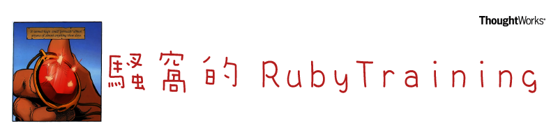

RubyTraining
===========

## Document Index

- [搭建开发环境](docs/setup.md)

- [Slides (Github Pages)](https://jiukunz.github.io/tw-ruby-training/slides/#/)

#### Slides Index

|标题|Slides|markdown|
|:--:|:----:|:------:|
| Ruby和它的小伙伴 | [slides/#/1](https://jiukunz.github.io/tw-ruby-training/slides/#/1) | [1-ruby-and-its-fellows.md](https://github.com/jiukunz/tw-ruby-training/blob/master/slides/contents/1-ruby-and-its-fellows.md) |
| 聊聊Ruby可爱的API | [slides/#/2](https://jiukunz.github.io/tw-ruby-training/slides/#/2) | [2-lovely-api.md](https://github.com/jiukunz/tw-ruby-training/blob/master/slides/contents/2-lovely-api.md) |
| Ruby Block | [slides/#/3](https://jiukunz.github.io/tw-ruby-training/slides/#/3) | [3-ruby-block.md](https://github.com/jiukunz/tw-ruby-training/blob/master/slides/contents/3-ruby-block.md) |
| Object-Oriented Programming in Ruby | [slides/#/4](https://jiukunz.github.io/tw-ruby-training/slides/#/4) | [4-ruby-oo.md](https://github.com/jiukunz/tw-ruby-training/blob/master/slides/contents/4-ruby-oo.md) |
| Meta Programming | [slides/#/5](https://jiukunz.github.io/tw-ruby-training/slides/#/5) | [5-ruby-meta-programming.md](https://github.com/jiukunz/tw-ruby-training/blob/master/slides/contents/5-ruby-meta-programming.md) |
| Rack and Sinatra | [slides/#/6](https://jiukunz.github.io/tw-ruby-training/slides/#/6) | [6-rack-and-sinatra.md](https://github.com/jiukunz/tw-ruby-training/blob/master/slides/contents/6-rack-and-sinatra.md) |
| REST and RESTful Web API | [slides/#/7](https://jiukunz.github.io/tw-ruby-training/slides/#/7) | [7-rest-and-restful-web-api.md](https://github.com/jiukunz/tw-ruby-training/blob/master/slides/contents/7-rest-and-restful-web-api.md) |
| Rails基础(1) | [slides/#/8](https://jiukunz.github.io/tw-ruby-training/keynote/rails入门.zip) |  |

